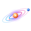
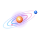
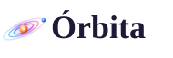
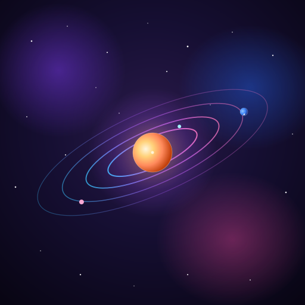
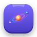
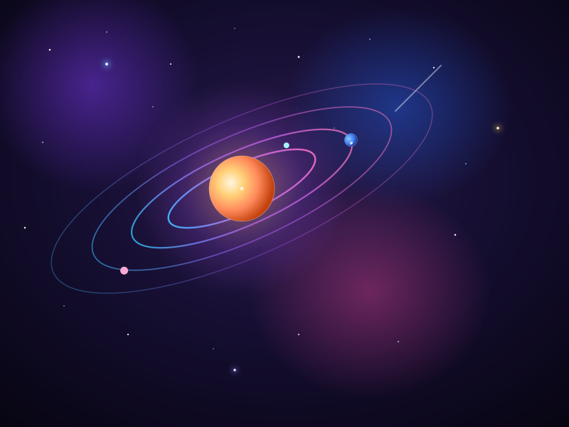
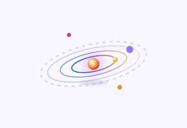

# Órbita — Nueva identidad de marca
**Manual de marca (propuesta)** · Dirección: *"tu universo en movimiento"*

> Propuesta creativa y técnica para la PWA. Todo lo que aparece aquí tiene activo entregado en
> `docs/manual-identidad/svg/` y es **implementable** (ver `IMPLEMENTACION.md`).

---

## 0. Resumen ejecutivo

**Insight:** el producto ya tiene un gran nombre latente — **Órbita** — y una metáfora visual
que nadie en su categoría ha sabido explotar: *"las cosas alrededor de ti"*. La llevamos a su
territorio natural: el **cosmos**.

**Decisión de marca (recomendación):**

| Decisión | Recomendación | Por qué |
|---|---|---|
| Nombre único | **Órbita** (descartar "Espacio" como nombre) | Diferenciable, ya está instalada en la UI/PWA, permite "orbitar" como verbo propio |
| "Espacio" queda como | Término descriptivo en la mensajería ("tu espacio") | Aprovecha el equity ya construido en README |
| Símbolo | **Elipse orbital + foco central** (Concepto 1) | Traduce la metáfora en una marca memorable y escalable |
| Idea de marca | *"Tu universo en movimiento alrededor de ti"* | Profundidad del cosmos (espacio profundo + estrellas) con el orden del anillo (violeta) y energía (cian + dorado) |

**Frase de marca (tagline):**
> **Órbita — tu universo en movimiento.**

(Alternativa: *"Tu cosmos, en orden."*)

**Verbo propio de la marca:** *orbitar*. Se usa en UI: "Orbita tus ideas", "Esta nota está en tu órbita".

---

## 1. Territorio y concepto

Tres ejes que definen toda la identidad:

1. **Foco central** — tú. La app gira en torno a tu página/nota/pendiente activo. Visualmente: el **sol radiante cálido** (tu energía, el foco de todo el sistema).
2. **Movimiento ordenado** — las órbitas. Tus cosas orbitan, ordenadas por ti. Visualmente: los **anillos concéntricos con gradiente** (cian → violeta → rosa).
3. **Profundidad cósmica** — espacio profundo, estrellas y nebulosas. Productividad con sensación de universo propio. Visualmente: los **gradientes de espacio profundo**.

Esto se traduce en un **contrato visual**: el *foco* siempre en **sol cálido** sobre espacio profundo, el
*movimiento* en **anillos concéntricos con gradiente**, y la *profundidad* en gradientes de nebulosa. La serif editorial
aporta la **quietud** que evita que el cosmos se sienta frío o "gamer".

---

## 2. Logotipo — 3 conceptos *(versión 3D)*

La marca usa un **lenguaje de profundidad** propio (ver §2.1): el **sol radiante** (foco cálido con halo
de nebulosa) en el centro de **anillos concéntricos con gradiente** (cian → violeta → rosa) en
perspectiva, con **esferas satélite con volumen** (gradiente radial + brillo especular). Eso da la
sensación de un sistema solar en miniatura orbitando en un espacio tridimensional.

### Concepto 1 · Órbita radiante *(recomendado)*
Un **sol cálido** con halo rodeado de **anillos concéntricos con gradiente** y un **planeta 3D** posado sobre el anillo exterior. Simple a 16px, con memoria a escala de app.

| Positivo | Negativo |
|---|---|
|  |  |

| Wordmark | Sello (app icon) |
|---|---|
|  |  |

### Concepto 2 · Apertura
Tu espacio como una **ventana** con un sistema solar dentro (sol + anillos concéntricos). Más literal, menos escalable a favicon.



### Concepto 3 · Monograma
Sello con la inicial sobre espacio profundo (evolución de la "E" actual, ya con color nuevo).


### Anatomía del logotipo (Concepto 1)

```
       ○ ●○  ← anillos concéntricos con gradiente cian→violeta→rosa, en perspectiva
        ◯    ← halo cálido de nebulosa alrededor del sol
        ●     ← SOL RADIANTE (foco: tu energía, tu pendiente activo)
        ·      ← brillo central
   ════○═☀️═══
        ⚫    ← planeta 3D posado sobre el anillo exterior (lo que se mueve contigo)
```

- **Sol radiante** (gradiente dorado→ámbar→naranja, sin especular: es una fuente de luz): el elemento en el que siempre hay que poner atención.
- **Halo** (cálido→violeta): la energía del foco expandiéndose hacia el espacio.
- **Anillos concéntricos** (gradiente cian→violeta→rosa): perspectiva; el grosor y la opacidad crecen hacia el centro (el anillo interior es el más vivo, 0.95).
- **Planeta 3D** (esfera azul con brillo especular): lo que se mueve contigo (tu siguiente tarea), posado sobre el anillo exterior.
- **Área de respiro**: la marca no debe tener texto dentro de la zona de los anillos.
- **Uso mínimo**: nunca comprimir la marca por debajo de 24px (usar el favicon en su lugar).

### Variantes permitidas
Positivo (perla estelar) · Negativo (espacio profundo/foto, con halo de nebulosa) · Monocromo (un solo color según contexto) ·
Sello (app icon, sobre degradado espacio profundo con campo de estrellas).

---

## 2.1 Lenguaje de profundidad (sistema 3D)

Cómo se construye la profundidad en toda la identidad, siempre de la misma manera:

| Elemento | Técnica | Resultado |
|---|---|---|
| **Sol** (foco) | **Gradiente radial cálido** (dorado → ámbar → naranja profundo) + **halo** de nebulosa (cálido → violeta). Sin especular: es fuente de luz | Foco radiante |
| Anillos orbitales | **Elipses concéntricas** con **gradiente lineal** (cian → violeta → rosa), en perspectiva; grosor y opacidad crecientes hacia el centro | Sistema solar en miniatura |
| Satélites / planetas | **Gradiente radial** con luz superior-izquierda + **brillo especular** (elipse blanca) | Esferas con volumen 3D |
| Sombra flotante | Elipse negra desenfocada debajo del conjunto (solo en escenas claras/UI) | Sensación de levitación |
| Fondo | Degradados de nebulosa + campo de estrellas + halos | Profundidad atmosférica |
| Capas | Estrellas de fondo (pequeñas) → sistema solar → estrellas en primer plano con resplandor | Paralaje |

**Regla de diseño:** los **íconos de interfaz (UI) se mantienen planos** (trazo 1.75); el lenguaje 3D se
reserva a la **marca, los sellos y las ilustraciones**. Así el sistema se siente vivo sin que la UI se
vuelva ruidosa.

---

## 3. Paleta de color — GALAXIA

### Oscuro · "Espacio profundo" *(modo natural de la marca)*

| Rol | Token | Hex | Uso |
|---|---|---|---|
| Fondo | `--bg` | `#0C0920` | Fondo general (noche espacial) |
| Superficie | `--sidebar` | `#131030` | Panel lateral |
| Papel | `--card` | `#191438` | Tarjetas, inputs, modales |
| Texto | `--ink` | `#F1EEFF` | Texto principal (luz de estrellas) |
| Texto 2º | `--muted` | `#9C94C9` | Secundario |
| Línea | `--border` | `#2B2550` | Bordes y divisores |
| **Acento (anillo)** | `--accent` | `#8B7CFF` | Botones, links, activo, anillos |
| Foco suave | `--accent-soft` | `#221C47` | Fondos de acento |
| Nota | `--callout` | `#1B1740` | Bloque nota |
| Cometa (foco) | `--comet` | `#5CC8FF` | Foco, links, satélites, info |
| Supernova | `--star` | `#FFC24B` | Rayas, logros, decoración |
| Peligro | `--danger` | `#E85D75` | Errores / destructivo (rosa nebulosa) |

### Claro · "Amanecer estelar"

| Rol | Hex |
|---|---|
| `--bg` | `#F8F6FF` · `--sidebar` `#EFECFF` · `--card` `#FFFFFF` |
| `--ink` | `#1E1936` · `--muted` `#5E5884` · `--border` `#E1DDF6` |
| `--accent` | `#5B4BD8` · `--accent-soft` `#ECE9FF` · `--callout` `#F0EEFF` |
| `--comet` | `#0E7490` · `--star` `#D99A2B` · `--danger` `#C2415F` |

### Contrastes objetivo (verificados)

| Par | Ratio aprox. | Cumple |
|---|---|---|
| `#F1EEFF` sobre `#0C0920` (ink/dark bg) | ~17:1 | AAA |
| `#9C94C9` sobre `#0C0920` (muted dark) | ~7:1 | AA |
| `#8B7CFF` sobre `#0C0920` (accent dark) | ~6:1 | AA |
| `#1E1936` sobre `#F8F6FF` (ink claro) | ~13:1 | AAA |
| `#5E5884` sobre `#F8F6FF` (muted claro) | ~6:1 | AA |
| `#5B4BD8` sobre `#FFFFFF` (accent claro) | ~6:1 | AA |
| `#FF8A5C` sobre `#0C0920` (sol dark) | ~9:1 | AAA |
| `#C2410C` sobre `#FFFFFF` (sol claro) | ~4.6:1 | AA · decorativo |

> El **sol cálido (dorado → ámbar → naranja) es decorativo** (no para texto pequeño): se usa en marca,
> ilustraciones y el punto de foco. Los botones primarios rellenos usan violeta (o el "strong" más
> profundo `#6D5AE6` en oscuro) para garantizar AA con texto blanco.

### Regla de uso
80% neutros del espacio · 15% violeta · 5% cálido (sol) + cian (anillos). Si algo brilla de más, no es Órbita.

---

## 4. Tipografía

**Dirección:** *serif editorial para pensar, sans neutral para operar* (mantiene el ADN actual, ahora controlado).
En un tema de espacio profundo, la serif es lo que da calma y legibilidad.

| Rol | Fuente | Uso |
|---|---|---|
| Display / Editor | **Fraunces** (Google Fonts, variable) | Título de página, encabezados de vista, login, wordmark |
| UI / Cuerpo | **Inter** (o *Sora* si se quiere más personalidad) | Toda la interfaz |
| Datos técnicos (opcional) | **JetBrains Mono** | Fechas, IDs, números de lista |

**Por qué Fraunces:** serif con carácter "soft", moderna y cálida; escala variable (peso, óptica, suavidad)
que permite una jerarquía rica sin añadir familias; tiene acentos españoles completos; gratuita.
Contraste intencional con el sans de UI, igual que Notion/Linear usan serif editorial, pero con **profundidad cósmica**.

**Escala base (sistema 4px):**

| Nivel | Fraunces | Inter |
|---|---|---|
| Display | 40 / 1.1 · peso 700 | — |
| H1 (título de página) | 30 / 1.15 · 700 | — |
| H2 | 24 / 1.2 · 600 | — |
| H3 | 19 / 1.3 · 600 | — |
| Cuerpo | — | 15 / 1.6 · 400 |
| UI (botones, nav) | — | 13 / 1.4 · 500 |
| Etiquetas / captions | — | 11 / 1.3 · 600, `uppercase tracking` |

**Carga:** self-host con `@fontsource-variable/fraunces` y `@fontsource-variable/inter` (o Google Fonts
con `display=swap`). Los `woff2` ya entran en el precache de Workbox (patrón `*.woff2` existente).

---

## 5. Iconografía

### Sistema de íconos
- **Base:** lucide-react (ya usado) con **trazo unificado 1.75** y extremos/empalmes redondeados
  (`stroke-width`, `stroke-linecap="round"`, `stroke-linejoin="round"`).
- **Regla de color:** íconos en `--muted`/`--ink`; el acento solo en el estado activo. Nunca múltiples
  colores en un ícono del sistema.

### Set de marca para módulos (entregado)
Cada módulo principal recibe un ícono con la "firma sol" (un punto cálido de foco):


| Ícono | Módulo | Firma |
|---|---|---|
| Documento con foco | Páginas | ✓ |
| Calendario con foco | Calendario | ✓ |
| Lista con check | Agenda | ✓ |
| Barras ascendentes | Analíticas | ✓ |
| Rueda simple | Ajustes | ✓ |
| Papelera | Papelera | — |

### Íconos de página (editor)
- **Hoy:** emojis (`📄 📝 💡`) — dependientes de plataforma.
- **Propuesta a corto plazo:** mantener emoji **pero enmarcado** en una "ficha" redondeada con fondo
  `--accent-soft` (unifica visualmente sin borrar la expresividad).
- **Propuesta a medio plazo:** banco de ~24 íconos vectoriales propios en el mismo lenguaje de trazo.

---

## 6. Imágenes e ilustraciones

### 6.1 Login — ilustración "Órbita radiante" (entregada, versión 3D)
Escena de espacio profundo en capas: nebulosas violeta/azul/rosa, campo de estrellas de fondo,
un **sol radiante con halo** al centro de **cuatro anillos concéntricos con gradiente** y un **planeta 3D**
con brillo especular, más estrellas en primer plano con resplandor (paralaje) y una estrella fugaz.



**Integración:** usar como lado visual del login en desktop (split layout) y como fondo superior en móvil
(con el formulario sobre tarjeta `--card`).

### 6.2 Estados vacíos — "tu órbita espera" (entregada, versión 3D)
Mismo lenguaje de profundidad en pequeño: sol con volumen y brillo, anillos concéntricos, satélite 3D y sombra flotante (escena clara).



Usos: sin páginas, agenda vacía, papelera vacía, calendario sin eventos. Acompañada de microcopy:
- "Tu órbita está vacía" → *"Tu órbita está vacía. Crea una página y ponla en órbita."*

### 6.3 Dirección fotográfica (para landing / portada de compartidos)
- **Temas:** escritorios de noche, luz de luna, pantallas con gradientes cósmicos, papelería bajo luz cálida, cielos nocturnos.
- **Tratamiento:** tono frío con acentos violeta/cian; duotono violeta+cian en sobreimpresiones; grano sutil de estrellas.
- **Evitar:** azules "empresariales" fríos sin personalidad, brillos de "tech" genéricos, fotos con gente en traje.

---

## 7. Sistema de UI (actualización del actual)

| Token | Valor | Sustituye a |
|---|---|---|
| Radius `sm` | 8px | `rounded-md`/`lg` dispersos |
| Radius `md` | 12px | inputs, tarjetas |
| Radius `lg` | 16px | modales, menús, tarjetas grandes |
| Radius `pill` | 999px | pills, avatares |
| Sombra `sm` | `0 1px 2px rgba(11,7,34,.06)` | `shadow-sm` |
| Sombra `md` | `0 8px 24px rgba(11,7,34,.14)` | `shadow-md` |
| Sombra `lg` | `0 20px 50px rgba(11,7,34,.24)` | `shadow-xl/2xl` |
| Glass | `bg` 85% + `backdrop-blur(12px)` | mantener `bg-header` |
| Motion | 150–250ms, easing `cubic-bezier(.2,.6,.3,1)` | animaciones ad-hoc |

**Botones**
- Primario: `--accent` + texto blanco; hover +4% brillo; active `scale(.98)` (mantener).
- Secundario: `--card` + borde `--border`.
- Peligro: `--danger`.
- **Foco visible:** anillo de 2px `--accent` con offset 2px en todos los elementos interactivos.

**Micro-detail de marca (opcional):** en hover de tarjetas del calendario, una elipse sutil que
"orbita" — movimiento dentro del manual, no fuera.

---

## 8. Aplicaciones PWA

| Activo | Propuesto | Archivo |
|---|---|---|
| App icon (192/512) | Sello órbita sobre espacio profundo | `svg/app-icon.svg` |
| Maskable | Fondo a sangre, marca en zona segura 80% | `svg/app-icon-maskable.svg` |
| Favicon | Marca simplificada (16–32px nítido) | `svg/favicon.svg` |
| Splash/loading | Fondo espacio profundo + marca | (se genera del app icon) |
| `theme-color` | `#0C0920` (espacio) en claro y oscuro | — |
| `apple-touch-icon` | PNG derivado del sello | — |
| Notificaciones | Badge con la marca; aviso de logro en dorado supernova | — |

---

## 9. Voz y tono

- **Tú, en español, con calma.** Frases cortas, sin jerga.
- **Verbo propio:** *orbitar*.
  - "Orbita esta idea." · "Tu nota está en órbita." · "Ponle fecha y déjala orbitar."
- **Microcopy de estados vacíos** (con ilustración): *"Tu órbita está vacía. Crea una página y ponla en órbita."*
- **Errores:** cálidos y con salida. "No se pudo guardar. Revisa tu conexión y vuelve a intentarlo."
- **Logros (analíticas):** tono celebratorio contenido, con dorado supernova.

---

## 10. Entregables y próximos pasos

| # | Entregable | Estado |
|---|---|---|
| 1 | Manual de identidad actual | ✅ `IDENTIDAD-ACTUAL.md` |
| 2 | Manual de identidad nueva | ✅ este documento |
| 3 | 3 conceptos de logo + wordmark | ✅ `svg/` |
| 4 | App icon + maskable + favicon | ✅ `svg/` |
| 5 | Set de íconos de módulos | ✅ `svg/iconos-modulos.svg` |
| 6 | Ilustración login + estados vacíos | ✅ `svg/` |
| 7 | Roadmap de implementación en código | ✅ `IMPLEMENTACION.md` |
| 8 | Validación: 3 mockups a elegir, test de contraste final | Pendiente de tu revisión |

**Para revisar:** abre los `.svg` de `docs/manual-identidad/svg/` en el navegador (o con el
plugin de Markdown que renderiza SVG). Si apruebas el Concepto 1, se procede con la implementación.
